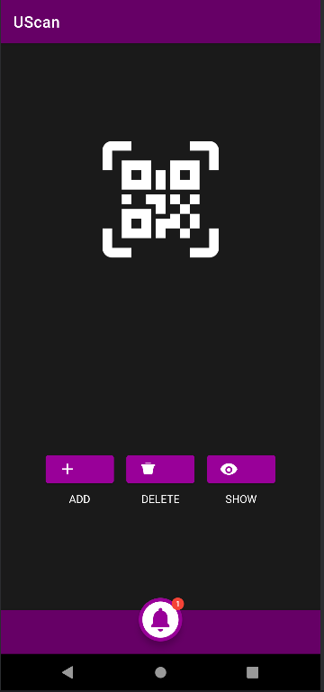
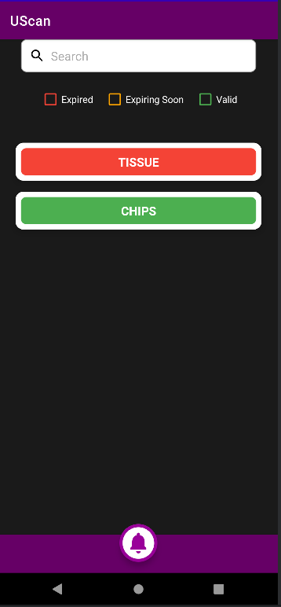
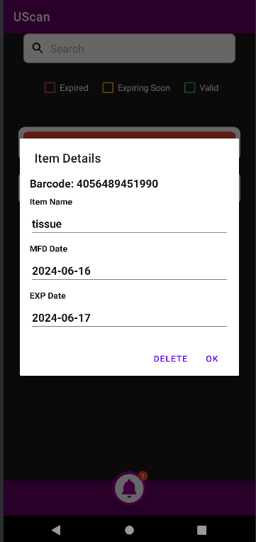

# UScan

UScan is an Android application that allows users to scan barcodes using their device's camera, manage inventory items, and track expiration dates. The app utilizes Firebase Firestore for data storage and provides various features like adding, deleting, and filtering items based on expiration status.

## Features

- Scan barcodes using the device's camera.
- Add items with details such as name, manufacture date, and expiration date.
- Delete items by scanning their barcode or on click of the individual item.
- Filter and display items based on their expiration status (Expired, Expiring Soon, Valid).
- Show a notification badge for items that have expired.
- Search functionality to quickly find items by name or barcode.

    

## Prerequisites

- Android Studio
- Firebase account
- Android device or emulator with a camera

## Getting Started

### Clone the Repository

```bash
git clone https://github.com/sruthi007/BarcodeScanner.git
cd BarCodeScanner
```

### Open in Android Studio

1. Launch Android Studio.
2. Open the project from the cloned repository directory.

### Setup Firebase Firestore

1. Create a Firebase project in the [Firebase Console](https://console.firebase.google.com/).
2. Add an Android app to your Firebase project and follow the instructions to download the `google-services.json` file.
3. Place the `google-services.json` file in the `app` directory of your project.
4. Add the required Firebase dependencies in your `build.gradle.kts` files as instructed by the Firebase setup.

### Build and Run the Application

To install an APK file(UScan.apk) on your Android device, follow these steps:

#### For Android Devices:

1. **Enable Unknown Sources:**
   - On your Android device, go to `Settings`.
   - Navigate to `Security` or `Privacy` (depending on your device).
   - Find and enable the option `Install unknown apps` or `Unknown sources`. This allows you to install apps from sources other than the Google Play Store.
     - If you are using Android 8.0 (Oreo) or higher, you might need to allow permissions for the specific app (like Chrome or a file manager) you will use to install the APK.

2. **Transfer the APK File to Your Device:**
   - Connect your device to your computer using a USB cable.
   - Transfer the APK file from the cloned repo(UScan.apk) to a location on your device’s internal storage or SD card where you can easily find it (e.g., the Downloads folder).

3. **Locate the APK File:**
   - On your device, use a file manager app to navigate to the location where you saved the APK file.

4. **Install the APK:**
   - Tap on the APK file(UScan.apk).
   - You will be prompted to confirm the installation. Tap `Install`.

5. **Complete the Installation:**
   - Wait for the installation process to complete. Once done, you can either open the app directly from the installation screen or find it in your app drawer.

#### For Emulators (e.g., Android Studio's Emulator):

1. **Open the Emulator:**
   - Launch the Android Emulator from Android Studio.

2. **Drag and Drop the APK:**
   - Drag the APK file(UScan.apk) from your computer and drop it onto the emulator screen.

3. **Install the APK:**
   - The emulator will automatically detect the APK file and begin the installation process.

4. **Complete the Installation:**
   - Once the installation is complete, you can open the app directly from the emulator.

## Usage

### Scanning Barcodes

- **Add Item:**
  1. Click on the `Add Item` button.
  2. Allow camera permission if prompted.
  3. Scan the barcode of the item.
  4. Enter item details in the dialog and click "Add".

- **Delete Item:**
  1. Click on the `Delete Item` button.
  2. Allow camera permission if prompted.
  3. Scan the barcode of the item.
  4. Confirm deletion.

### Viewing and Filtering Items

- Click on the `Show Items` button to view the list of items.
- Use the checkboxes to filter items by their expiration status:
  - Expired
  - Expiring Soon
  - Valid
- Use the search bar to filter items by name or barcode.

### Viewing Expired Items

- Click on the Notification button to view a list of expired items. This appears on the first time and marked as read.

